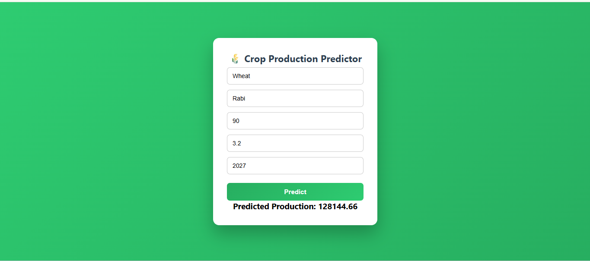

# 🌾 Crop Production Prediction System

> A Fullstack Machine Learning web application that predicts agricultural crop production using XGBoost regression with ~95% accuracy.

[](https://www.python.org/downloads/)
[](https://fastapi.tiangolo.com/)
[](https://reactjs.org/)


---

## 📋 Table of Contents

- [Overview](#-overview)
- [Features](#-features)
- [Tech Stack](#️-tech-stack)
- [Machine Learning Details](#-machine-learning-details)
- [Architecture](#️-architecture)
- [Project Structure](#-project-structure)
- [Installation & Setup](#-installation--setup)
- [API Documentation](#-api-documentation)
- [Usage Examples](#-usage-examples)
- [Screenshots](#-screenshots)
- [Future Enhancements](#-future-enhancements)
- [Contributing](#-contributing)
- [License](#-license)
- [Author](#-author)

---

## 🎯 Overview

Agricultural production forecasting is crucial for food security and resource planning. This project leverages machine learning to predict crop production based on historical agricultural data.

**Key Problem Solved:**  
Estimating crop production helps farmers, policymakers, and agricultural businesses make informed decisions about resource allocation, pricing, and planning.

**Solution:**  
An intelligent web application that predicts production values using inputs like crop type, season, cultivated area, yield, and year.

---

## ✨ Features

- 🎯 **Accurate Predictions** - XGBoost model with 95% R² score
- 🌐 **User-Friendly Interface** - Clean, responsive React frontend
- ⚡ **Fast API** - High-performance FastAPI backend
- 🔄 **Real-time Processing** - Instant prediction results
- 📊 **Smart Encoding** - Automatic categorical variable handling
- 🔍 **Input Validation** - Robust error handling and validation
- 📱 **Responsive Design** - Works on desktop and mobile devices
- 🚀 **Production Ready** - Deployable on cloud platforms

---

## 🛠️ Tech Stack

### Frontend


### Backend


### Machine Learning & Data Science
- **Pandas** - Data manipulation and analysis
- **NumPy** - Numerical computations
- **Scikit-learn** - Model evaluation and preprocessing
- **XGBoost** - Gradient boosting regression model
- **Category Encoders** - Target encoding for categorical features

### Model Persistence
- **Pickle** - Model serialization and deployment

### Deployment (Optional)
- **Backend:** Render / AWS / Heroku
- **Frontend:** Netlify / Vercel / GitHub Pages

---

## 🧠 Machine Learning Details

### Model Specifications

| Component | Details |
|-----------|---------|
| **Algorithm** | XGBoost Regressor |
| **Model Type** | Supervised Learning (Regression) |
| **Target Variable** | Crop Production (tonnes) |
| **Performance Metric** | R² Score ≈ **95%** |

### Features Used

#### Categorical Features
- **Crop** - Type of crop (Rice, Wheat, Cotton, etc.)
- **Season** - Growing season (Kharif, Rabi, Summer)

#### Numerical Features
- **Area** - Cultivated area (hectares)
- **Yield** - Crop yield (kg/hectare)
- **Year** - Production year

### Preprocessing Pipeline

1. **Target Encoding** - Categorical variables encoded using target statistics
2. **Feature Scaling** - Applied where necessary
3. **Missing Value Handling** - Data cleaning and imputation
4. **Train-Test Split** - 80-20 split for validation

### Model Training Process

```python
# Key training parameters
xgb_params = {
    n_estimators=300,
    learning_rate=0.05,
    max_depth=6,
    subsample=0.8,
    colsample_bytree=0.8,
    random_state=42,
    n_jobs=-1}
```

---

## 🏗️ Architecture

```
┌─────────────────┐
│  React Frontend │
│   (Port 3000)   │
└────────┬────────┘
         │
         │ HTTP REST API
         │ (JSON Payload)
         │
         ▼
┌─────────────────┐
│ FastAPI Backend │
│   (Port 8000)   │
└────────┬────────┘
         │
         │ Feature
         │ Engineering
         │
         ▼
┌─────────────────┐
│ Target Encoder  │
│   (.pkl file)   │
└────────┬────────┘
         │
         │ Encoded
         │ Features
         │
         ▼
┌─────────────────┐
│  XGBoost Model  │
│   (.pkl file)   │
└────────┬────────┘
         │
         │ Prediction
         │
         ▼
┌─────────────────┐
│ Production Value│
│    (Output)     │
└─────────────────┘
```

---

## 📂 Project Structure

```
agriculture-project/
│
├── backend/
│   ├── main.py                      # FastAPI application
│   ├── crop_model.pkl               # Trained XGBoost model
│   ├── target_encoder.pkl           # Fitted encoder
│   ├── requirements.txt             # Python dependencies
│   └── render.yaml                  # Deployment config
│
├── frontend/
│   ├── public/
│   │   └── index.html
│   ├── src/
│   │   ├── App.js                   # Main React component
│   │   ├── App.css                  # Styling
│   │   ├── index.js                 # Entry point
│   │   └── index.css                # Global styles
│   ├── package.json                 # Node dependencies
│   └── package-lock.json
│
├── notebooks/
│   └── training_model_code.ipynb    # Model training notebook
│
├── data/
│   └── India Agriculture Crop Production.csv
│
├── .gitignore
├── README.md
```

---

## 🚀 Installation & Setup


### 🔹 Backend Setup

```bash
# Navigate to backend directory
cd backend

# Create virtual environment (recommended)
python -m venv venv

# Activate virtual environment
# On Windows:
venv\Scripts\activate
# On macOS/Linux:
source venv/bin/activate

# Install dependencies
pip install -r requirements.txt

# Run the FastAPI server
uvicorn main:app --reload
```

**Backend will be available at:**
- API: `http://127.0.0.1:8000`
- Interactive Docs: `http://127.0.0.1:8000/docs`
- ReDoc: `http://127.0.0.1:8000/redoc`

### 🔹 Frontend Setup

```bash
# Navigate to frontend directory
cd frontend

# Install dependencies
npm install

# Start development server
npm start
```

**Frontend will be available at:** `http://localhost:3000`

---

## 📚 API Documentation

### Predict Endpoint

**POST** `/predict`

#### Request Body

```json
{
  "crop": "Rice",
  "season": "Kharif",
  "area": 120.5,
  "yield": 3.8,
  "year": 2020
}
```

#### Response

```json
{
  "prediction": 458.9,
  "unit": "tonnes",
  "inputs": {
    "crop": "Rice",
    "season": "Kharif",
    "area": 120.5,
    "yield": 3.8,
    "year": 2020
  }
}
```

#### Error Response

```json
{
  "detail": "Invalid input data"
}
```

---

## 💡 Usage Examples

### Example 1: Rice Production

```json
{
  "crop": "Rice",
  "season": "Kharif",
  "area": 120,
  "yield": 3.8,
  "year": 2020
}
```

**Expected Output:** ~456 tonnes

### Example 2: Wheat Production

```json
{
  "crop": "Wheat",
  "season": "Rabi",
  "area": 90,
  "yield": 3.2,
  "year": 2019
}
```

**Expected Output:** ~288 tonnes

### Example 3: Cotton Production

```json
{
  "crop": "Cotton",
  "season": "Kharif",
  "area": 150,
  "yield": 2.5,
  "year": 2021
}
```

**Expected Output:** ~375 tonnes

---

## 📸 Screenshots


### Prediction Result



---

## 🔮 Future Enhancements

- [ ] **Regional Analysis** - Add State/District for location-specific predictions
- [ ] **Yield Forecasting** - Predict yield based on weather and soil data
- [ ] **Data Visualization** - Interactive charts and production trends
- [ ] **Historical Comparison** - Compare predictions with actual production
- [ ] **Database Integration** - Store predictions and user history
- [ ] **User Authentication** - Secure access with login system
- [ ] **Mobile App** - React Native or Flutter mobile application
- [ ] **Batch Predictions** - Upload CSV for bulk predictions
- [ ] **Dockerization** - Container-based deployment
- [ ] **CI/CD Pipeline** - Automated testing and deployment
- [ ] **Weather API Integration** - Real-time weather data incorporation
- [ ] **Soil Analysis** - Soil quality and composition features

---


## 👨‍💻 Author

**Kalyan Sai Atchi**

- 🎓 AI Fullstack Developer
- 🔗 GitHub: [@KALYANSAI-3114](https://github.com/KALYANSAI-3114)
- 💼 LinkedIn: [KalyanSai](https://www.linkedin.com/in/kalyan-sai-atchi-45539926a/)
- 📧 Email: kalyansai0909@gmail.com

---

## 🙏 Acknowledgments

- Dataset: India Agriculture Crop Production Dataset
- XGBoost Documentation
- FastAPI Framework
- React Community

---

## 📊 Project Stats

- **Model Accuracy:** ~95% R² Score
- **Technologies Used:** 10+
- **Lines of Code:** ~2000+
- **API Response Time:** <100ms

---

**⭐ If you found this project helpful, please give it a star!**

